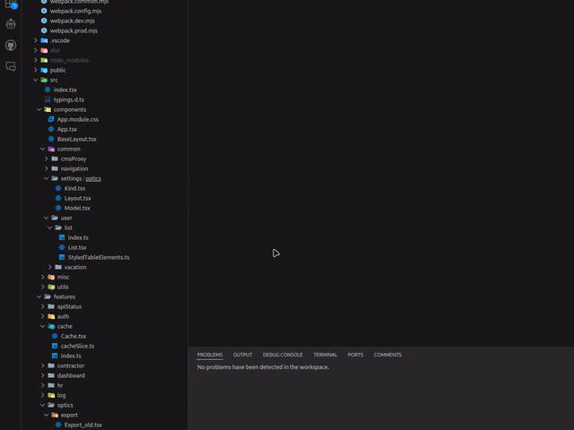

# Copy to LLM

<div align="center">


[](https://marketplace.visualstudio.com/items?itemName=Compile-TomaszKasperczyk.copy-to-llm)
[](https://marketplace.visualstudio.com/items?itemName=Compile-TomaszKasperczyk.copy-to-llm)
[](https://marketplace.visualstudio.com/items?itemName=Compile-TomaszKasperczyk.copy-to-llm)

Streamline your workflow with LLMs using this powerful VS Code extension!

</div>

<div align="center">



</div>

## Overview

"Copy to LLM" is a Visual Studio Code extension designed to simplify the process of collecting and formatting code for use with Large Language Models (LLMs) like ChatGPT. With just a few clicks, you can compile the contents of selected files or entire directories into a format that's optimized for LLM input.

## Features

- **Context Menu Integration:** Easily access the extension's functionality by right-clicking on files or folders in the VS Code Explorer.
- **Multi-Select Support:** Copy contents from multiple files and folders simultaneously.
- **Directory Traversal:** Recursively collect files from selected directories.
- **Customizable File Types:** Configure which file extensions to include when processing directories.
- **Formatted Output:** Generate well-structured content with file paths and appropriate code blocks.
- **Clipboard Support:** Quickly copy single file contents to your clipboard.
- **New Document Creation:** Open compiled content in a new VS Code document for easy editing and review.

## Installation

1. Open Visual Studio Code
2. Press `Ctrl+P` (or `Cmd+P` on macOS) to open the Quick Open dialog
3. Type `ext install Compile-TomaszKasperczyk.copy-to-llm` and press Enter
4. Click the Install button

Alternatively, you can install the extension from the [Visual Studio Code Marketplace](https://marketplace.visualstudio.com/items?itemName=Compile-TomaszKasperczyk.copy-to-llm).

## Usage

### Copy a Single File
1. Right-click on a file in the Explorer
2. Select "Copy to LLM"
3. A new document will open containing the formatted content of the selected file

### Process Multiple Files or Folders
1. Select multiple files and/or folders in the Explorer (use Ctrl/Cmd+Click for multi-select)
2. Right-click on one of the selected items
3. Choose "Copy to LLM"
4. A new document will open containing the formatted content of all selected items

### Process an Entire Folder
1. Right-click on a folder in the Explorer
2. Select "Copy to LLM"
3. A new document will open with the formatted content of all matching files in the folder and its subfolders

You can copy the contents of the new document and paste it as the prompt of your LLM.

## Configuration

You can customize which file types are included when processing directories. To do this:

1. Open VS Code Settings (File > Preferences > Settings)
2. Search for "Copy to LLM"
3. Edit the "Copy to LLM: Extensions" setting to add or remove file extensions

Default included extensions:
```json
[".ts", ".tsx", ".mjs", ".ex", ".heex", ".svelte"]
```

## Example Output

When you use "Copy to LLM" on a file or directory, the output will look similar to this:

```markdown
src/components/Button.tsx:
```tsx
import React from 'react';

const Button = ({ label, onClick }) => (
  <button onClick={onClick}>{label}</button>
);

export default Button;
```

src/utils/helpers.ts:
```typescript
export const capitalizeString = (str: string): string => {
  return str.charAt(0).toUpperCase() + str.slice(1);
};
```

This format makes it easy to understand the structure of your code when sharing it with an LLM.

## Contributing

Contributions are welcome! If you'd like to contribute to this project, please follow these steps:

1. Fork the repository
2. Create a new branch for your feature or bug fix
3. Make your changes and commit them with a clear commit message
4. Push your changes to your fork
5. Create a pull request to the main repository

Please ensure your code adheres to the existing style and includes appropriate tests.

## License

This project is licensed under the MIT License. See the [LICENSE](LICENSE) file for details.

## Support

If you encounter any issues or have suggestions for improvements, please [open an issue](https://github.com/TKasperczyk/vscode-copy-to-llm/issues) on our GitHub repository.

## Acknowledgements

Special thanks to all the contributors and users who have helped improve this extension. Your feedback and support are greatly appreciated!

<div align="center">
  Made with ❤️ by developers, for developers
</div>